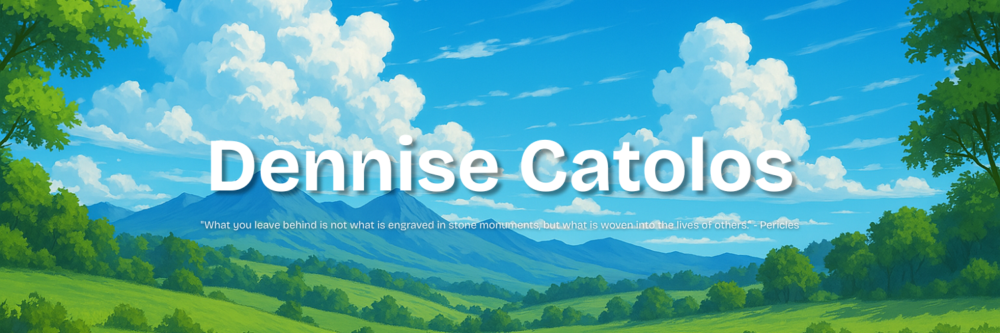

  
   
   
  <a href="https://dennise.me"><kbd>   🌐 My Website   </kbd></a> &bullet;
  <a href="https://dennise.me/go/linkedin"><kbd>   👨‍👩‍👧‍👦 Let's Connect   </kbd></a> &bullet;
  <a href="https://dennise.me/go/sponsor"><kbd>   💵 Sponsor Me   </kbd></a>

---

## ⭐ Star Projects

- [**Virage**](https://virage.app) — A vishing simulation platform designed for educating the vulnerable and helping them understand and recognize voice and email phishing attacks!
- [**Initiate**](https://initiate.global) — A community platform for connecting startups, investors, and businesses alike in one place! Accelerate and grow your startup!

## 🗃️ Hackathon Projects

| Hackathon / Competition                        | Project / Team                                                    | Stage         | Achievement      |
| ---------------------------------------------- | ----------------------------------------------------------------- | ------------- | ---------------- |
| National AI Student Challenge 2026             | [Logdog](https://github.com/dentolos19/logdog)                    | National      | Ongoing          |
| 6th Kibo Robot Programming Challenge           | AstroVibe                                                         | International | Top 11           |
| Smart Nation Award Competition 2025            | Virage                                                            | National      | Winner           |
| DSTA BrainHack 2025                            | Brain.exe                                                         | National      | N/A              |
| hacksingapore 2024                             | [Finn](https://github.com/dentolos19/finn)                        | National      | N/A              |
| Code Overflow 2024                             | [Pennywise](https://github.com/dentolos19/pennywise)              | School        | Committee Choice |
| Code Overflow 2023                             | [Anywhere Fitness](https://github.com/dentolos19/anywherefitness) | School        | Top 3            |
| National Cyberwellness Advocacy Challenge 2022 | [Faker Spotter](https://github.com/dentolos19/fakerspotter)       | National      | Silver           |

## 📎 Other Projects

- [**Personal Projects**](https://github.com/dentolos19?tab=repositories&q=topic%3Apersonal): My personal work for the general public.
- [**Community Projects**](https://github.com/dentolos19?tab=repositories&q=topic%3Acommunity): My work for the open source community.
- [**Hackathon Projects**](https://github.com/dentolos19?tab=repositories&q=topic%3Ahackathon): My hackathon projects.
- [**School Assignments**](https://github.com/dentolos19?tab=repositories&q=topic%3Aassignment): My school work.
