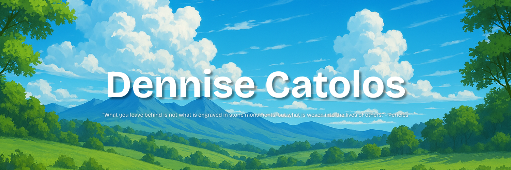

  
   
   
  <a href="https://dennise.me"><kbd>   🌐 My Website   </kbd></a> •
  <a href="https://dennise.me/go/linkedin"><kbd>   👨‍👩‍👧‍👦 Let's Connect   </kbd></a> •
  <a href="https://dennise.me/go/sponsor"><kbd>   💵 Sponsor Me   </kbd></a>

---

  <a href="https://commit-history.com/dentolos19">
    <picture>
      <source media="(prefers-color-scheme: dark)" srcset="https://commit-history.com/embed/dentolos19?theme=dark" />
      
    </picture>
  </a>

---

## ⭐ Star Projects

- [**Virage**](https://virage.app) — Detecting and disrupting voice scams before they can deceive, manipulate, or cause harm.
- [**+ONE**](https://plusone.help) — Turning estate insights and on-the-ground observations into smarter, more liveable communities.

## 🗃️ Hackathon Projects

| Hackathon / Competition                        | Project / Team                                                                     | Stage         | Achievement      |
| ---------------------------------------------- | ---------------------------------------------------------------------------------- | ------------- | ---------------- |
| 7th Kibo Robot Programming Challenge (2026)    | Anomaly                                                                            | International | *Ongoing*        |
| National AI Student Challenge 2026             | [Logdog](https://github.com/dentolos19/logdog)                                     | National      | Top 8 (Micron)   |
| 6th Kibo Robot Programming Challenge (2025)    | [AstroVibe](https://humans-in-space.jaxa.jp/krpc/6th/#:~:text=Astrovibe,Singapore) | International | Top 11           |
| Code Overflow 2024                             | [Pennywise](https://github.com/dentolos19/pennywise)                               | School        | Committee Choice |
| Code Overflow 2023                             | [Anywhere Fitness](https://github.com/dentolos19/anywherefitness)                  | School        | Top 3            |
| National Cyberwellness Advocacy Challenge 2022 | [Faker Spotter](https://github.com/dentolos19/fakerspotter)                        | National      | Silver           |

## 📎 My Projects

- [**Personal Projects**](https://github.com/dentolos19?tab=repositories&q=-topic%3Aexperimental%2Chackathon%2Cassignment&sort=stargazers): My work made for the general public.
- [**Community Projects**](https://github.com/dentolos19?tab=repositories&q=topic%3Acommunity&sort=stargazers): My work made for the open source community.
- [**Experimental Projects**](https://github.com/dentolos19?tab=repositories&q=topic%3Aexperimental&sort=stargazers): My experimental projects.
- [**Hackathon Projects**](https://github.com/dentolos19?tab=repositories&q=topic%3Ahackathon&sort=stargazers): My hackathon projects.
- [**School Assignments**](https://github.com/dentolos19?tab=repositories&q=topic%3Aassignment&sort=stargazers): My school assignments.
